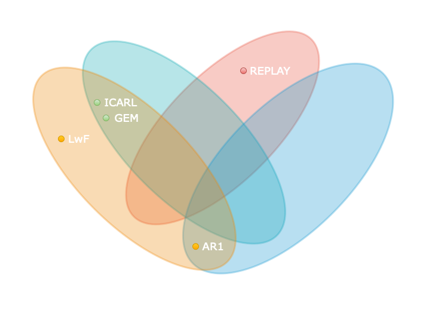

    
# Continual Learning for resource-scarce devices

Repository that is intended to keep track of my thesis work and that contains all the reference material and the scripts developed to this end.

### Overleaf project
Draft of the final dissertation (ongoing): [Thesis-Overleaf project](https://www.overleaf.com/read/cxcxbjznmrxx)

### Outline
1. Introduction
   - Machine Learning: the good and bad
   - Continual Learning
   - Thesis outline and methods
2. Background and Motivation
   - Introduction on Artificial Intelligence
   - Artificial Intelligence on embedded systems
   - Machine Learning
   - Tiny Machine Learning
   - Motivation
3. Continual Learning
   - Introductive framework for Continual Learning
   - Continual learning approaches for efficient ML
     - Architectural
     - Regularization
     - Rehearsal
     - Generative Replay
   - Continual learning benchmarks and protocols
     - LwF
     - AR1
     - GEM
     - ICARL
     - Replay  
4. Software environment and experimental application
   - Avalanche library, brief overview
   - Description of the implemented algorithms in Jupyter Notebook
   - Metrics of evaluation
5. Results and comparison by selected algorithm
   - LOG and Display of the results
7. Conclusion and future challenges

### Description
Comprehensive research that compares the performance of different continuos learning algorithms on small images dataset for tinyML applications involving on-device, low-power image recognition and classification, and investigates (in a simulated scenario) the trade-offs between performance, storage, computational costs and memory footprint.

Main references                                             | link         
------------------------------------------------------------|---------------------------------
**ContinualAI**                                             | https://course.continualai.org
**Avalanche library for CL**                                | https://arxiv.org/abs/2104.00405
Online CL in Image Classification                           | https://arxiv.org/abs/2101.10423
Performance of CL for embedded sensing applications         | https://arxiv.org/abs/2110.13290
-- **Metrics and Evaluation of CL algorithms** --           |  
Continual Learning in Single-Incremental-Task scenarios     | https://arxiv.org/abs/1806.08568
Continual Learning for Robotics                             | https://arxiv.org/abs/1907.00182
Benchmarking TinyML Systems: Challenges and Direction       | https://arxiv.org/abs/2003.04821
Towards Robust Evaluations of Continual Learning            | https://arxiv.org/abs/1805.09733
... New metrics for Continual Learning                      | https://arxiv.org/abs/1810.13166

In consequence of the *catastrophic forgetting* problem, enabling deep learning models to train continuously is extremely difficult in practice. Many approaches have been proposed but most of the existing CL techniques do not take into account the resource requirements, so it's unsure if they'd work in severly resource constrained devices, such as embedded systems.

For these reasons, to **further investigate whether an approach could be relevant to resource-constrained devices**, I'll start from the findings discussed in the underlying papers and, as main part of the work, try to complete a comprehensive survey and simulated comparison of these state of the art algorithms.
***

### Avalanche - end-to-end library for Continual Learning
Open-source end-to-end library for continual learning based on Pytorch, devised to ease the implementation, assessment and replication of continual learning algorithms across different settings.

  
**[Avalanche Website](https://avalanche.continualai.org)** | **[Avalanche Repository](https://github.com/ContinualAI/avalanche)**

***

## Research objectives and methods
This thesis contributes to the study of different Continual Learning algorithms, focused on continual supervised learning for vision tasks, that could best suit resource-constrained devices.  
Through the development of some simulated experiments, **the goal** is to better understand the specific configuration needed to achieve optimal results in resource-constrained devices, which means in turn to play with different hyper-parameters and such.

### Action plan

#### 1. EXPERIMENT  
The very first step of this thesis-project is to **provide a set of experiments validating and reproducing existing works in continual learning.**
To guarantee fair implementations, I rely on the `Avalanche` library, developed and maintained by ContinualAI.  
> A critical design objective of Avalanche is in fact to allow experimental results to be seamlessly reproduced; continual learning algorithms today are often
designed and implemented from scratch with different assumptions, settings, and benchmarks that make them difficult to compare among each other or even port to slightly different contexts.

**Continuous Learning strategies:**  
Recently, a growing number of approaches have been presented on CL based on both variations of already existing and well known strategies or completely novel approaches with different degrees of success.  
Here I propose a list of experiments based on some of the most popular, yet interesting, CL techniques inspired by the state of the art.

In order to improve its performance or expand its set of capabilities, the target system powered by a continual learning strategy is required to learn from a non-stationary stream of experiences.  
The `benchmarks` are recipes that specify how this stream of data is created by defining the originating dataset and the contents of the stream.  
Benchmarks hereafter are (so far) based on reshaped versions of well-known datasets such as MNIST and CIFAR-100.

CL Approach     |    Technique                      | Benchmark                        | Resources        | Implemented  [Y/N]             
----------------|-----------------------------------|----------------------------------|------------------|----------------------------------------------------
Regularization  | LwF                               | Split MNIST                      | https://arxiv.org/abs/1606.09282  https://arxiv.org/abs/1904.07734 | N
Architectural Regularization  | AR1                 | Split CIFAR 100                  | https://arxiv.org/abs/1806.08568                                   | N
Rehearsal Regularization      | GEM                 | Split CIFAR 10                   | https://arxiv.org/abs/1706.08840                                   | N    
Rehearsal Regularization      | iCaRL               | Split CIFAR 100                  | https://arxiv.org/abs/1611.07725                                   | N
Generative Replay             | Replay              | MNIST                            | https://arxiv.org/abs/2108.06758                                   | N

Combining different strategies allows to find the best solutions to tackle catastrophic forgetting:

 

#### 2. EVALUATE  
**This section aims at evaluating CL approaches in the context of resource-scarse devices.**   
Given the fact that embedded systems are built for specific purposes and are optimized to meet different kind of constraints, such as memory, timing, power and cost, the performance of each Continual Learning algorithm are to be evaluated by monitoring several aspects of the computation.  
Continual learning algorithms learn from a stream of data in a continuous and adaptable manner throughout time, allowing for the progressive development of ever more complicated knowledge and abilities. The lack of agreement in evaluating continuous learning algorithms, as well as the almost exclusive focus on forgetting, make it even more difficult to define a robust evaluation of CL strategies for embedded systems and robotics.

The evaluation of those algorithms has to provide insights on whether their solutions may help continual learning in the context of resource-scarse devices. It is not enough to observe good final accuracy on an algorithm to know if it's transferable to embedded settings, but additional metrics have to be taken into account for it to suffice. In this context, I propose a more **comprehensive set of implementation independent metrics** accounting for several factors I believe have practical implications worth considering in the deployment of real AI systems that learn continually:
- Accuracy or Performance over time  
- BWT: Backward knowledge transfer
- FWT: Forward knowledge transfer 
- Model size and Memory efficiency: space occupied by the model, increment in space required for each new experience 
- Computational efficiency: computational overhead during training (running time, MACs, CPU time, ..) and inference.

Drawing inspiration from the `Evaluation` module of Avalanche, I evaluate my proposal with five continual learning strategies on the MNIST and iCIFAR-100 continual learning benchmarks.

**Tensorboard** logs all the metrics in real-time; from terminal:  
- tensorboard --logdir /Users/MichaelB/TesiLM-ContinualAI_Avalanche/Sttegies/tb_data  
- localhost http://localhost:6006

#### 3. LOG and DISPLAY RESULT
Logging tools are essential for **monitoring the activity of an ongoing experiment.**  
The `Logging` module of Avalanche is used to display each plugin metric during training and evaluation.

#### 4. CONCLUSION
On-device training is subject to many real world constraints, strict computational and memory limitations.  
In this thesis work, I want to show that a proper fine-tuned continual learning strategy can provide an efficient and effective approach for sustainable on-device personalization while controlling forgetting on previously acquired knowledge.

In future evaluation scenarios, particularly in resource-constrained devices, stability is another important property that should be evaluated since in many tasks, potential abrupt performance drifts would be a major concern when learning continuosly.
